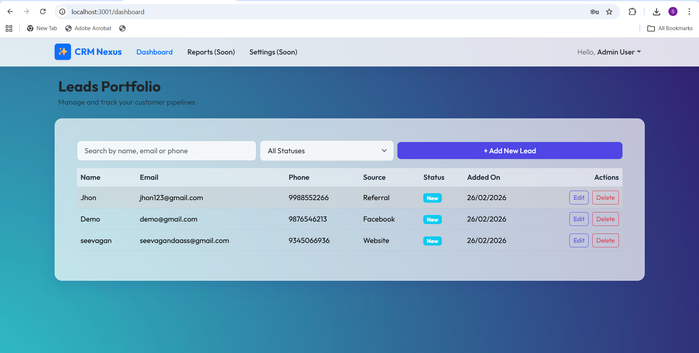
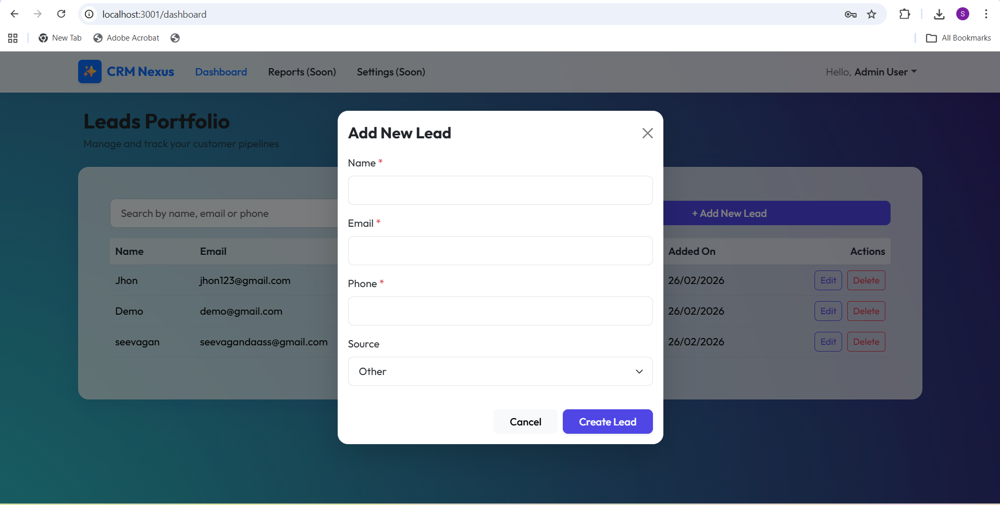
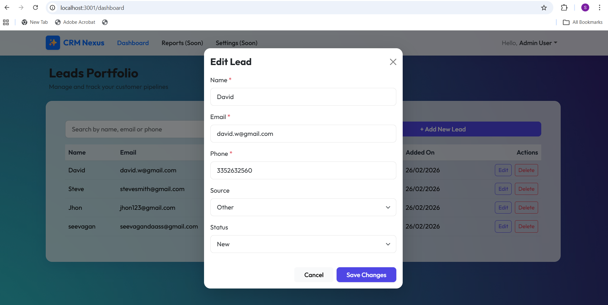
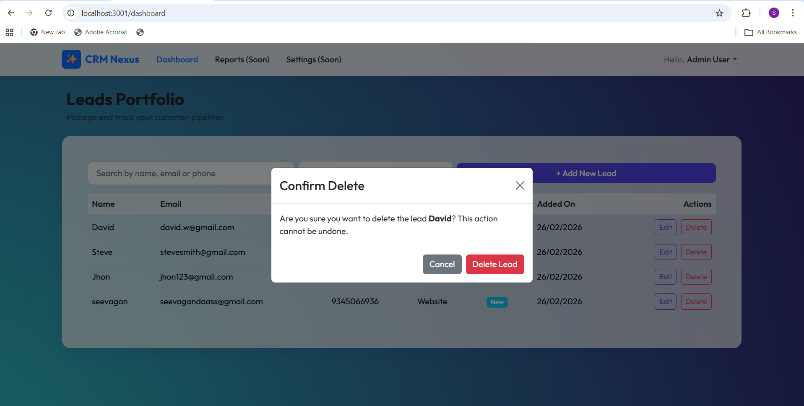

# Leads Management CRM

A complete Leads Management CRM built with the MERN stack (MongoDB, Express, React, Node.js). It includes JWT-based authentication, paginated data tables, search, filtering, and full CRUD for leads management.

## 🚀 Built With

### Frontend Stack
* **React.js** (Bootstrapped with Vite)
* **React Bootstrap** for UI components
* **Axios** for API requests & automatic token attachment via interceptors
* **React Router Dom** for client-side routing

### Backend Stack
* **Node.js** with **Express.js** 
* **MongoDB** with **Mongoose** for ORM
* **JSON Web Tokens (JWT)** for authentication
* **bcryptjs** for password hashing

---

## 🛠️ Setup Instructions

### Prerequisites
* [Node.js](https://nodejs.org/) installed
* [MongoDB](https://www.mongodb.com/) running locally or a MongoDB Atlas URI

### 1. Clone & Install Dependencies

From the project root:

```sh
# Install Backend Dependencies
cd backend
npm install

# Install Frontend Dependencies
cd ../frontend
npm install
```

### 2. Environment Variables
Create a `.env` file in the `backend/` directory by referring to `.env.example`:

```env
NODE_ENV=development
PORT=5000
MONGO_URI=mongodb://127.0.0.1:27017/leads-crm
JWT_SECRET=Seevagan@12
```

### 3. Running the Application

Open two terminal windows:

**Terminal 1 (Backend - Port 5000):**
```sh
cd backend
npm run dev
```

**Terminal 2 (Frontend - Port 3000):**
```sh
cd frontend
npm run dev
```

Once running, the frontend will be accessible at `http://localhost:3000` and the backend strictly running on `http://localhost:5000`.

---

## 🌐 API Endpoints

### Authentication
* `POST /api/auth/register` - Register a new user
* `POST /api/auth/login` - Authenticate and get token

### Leads (Requires JWT Bearer Token)
* `GET /api/leads` - Get all leads (Supports pagination, search, status filter)
* `GET /api/leads/:id` - Get single lead by ID
* `POST /api/leads` - Create a new lead
* `PUT /api/leads/:id` - Update Lead details
* `DELETE /api/leads/:id` - Soft delete a lead (sets isActive to false)

---

## 📄 Example API Responses

### `POST /api/auth/login`
```json
{
  "_id": "64f9b2d...",
  "name": "Jane Doe",
  "email": "jane@example.com",
  "token": "eyJhbGciOiJIUzI1NiIsInR5cCI6Ikp..."
}
```

### `GET /api/leads?page=1&limit=10&search=John`
```json
{
  "success": true,
  "count": 1,
  "total": 1,
  "page": 1,
  "pages": 1,
  "data": [
    {
      "isActive": true,
      "_id": "64fa13c...",
      "name": "John Doe",
      "email": "john@doe.com",
      "phone": "1234567890",
      "status": "New",
      "source": "Website",
      "createdAt": "2023-09-07T10:30:00.000Z",
      "updatedAt": "2023-09-07T10:30:00.000Z"
    }
  ]
}
```
## 📷 Screenshots

### Login Page


### Dashboard


### Add Leads


### Edit Leads


### Delete Leads

---

## 💡 Code Quality & Structure

- **Clean Naming Conventions:** Restful API routes (`/api/leads`) and logical variable names.
- **Error Handling wrapper:** Used `express-async-handler` to avoid bulky try/catch blocks on every controller in the backend. Centralized error middleware formats all responses nicely securely hiding stacks in production.
- **Frontend Interceptors:** Configured Axios interceptors to seamlessly pass tokens to protected routes, and intercept 401 unauthenticated errors to automagically log users out.
- **Secure Password Hashing:** User schema uses bcrypt pre-saving hooks to protect raw passwords.
- **Soft Deletes:** Deletes simply toggle the boolean `isActive` field hiding it from normal queries without true deletion.
- **Pagination logic setup correctly via skip & limit optimizations.**
- **Commit Structure Suggestions:** When working on this locally, attempt to follow `feat/fix/chore` style syntax for clear GIT history logging. e.g., `feat: added authentication middleware`.
